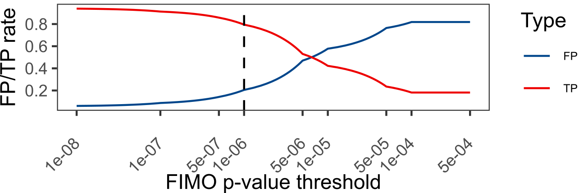

<!-- README.md is generated from README.Rmd. Please edit that file -->

# CTCF

[](https://lifecycle.r-lib.org/articles/stages.html#stable)
<!-- [](https://bioconductor.org/checkResults/release/bioc-LATEST/CTCF) [](https://github.com/mdozmorov/CTCF/actions/workflows/R-CMD-check-bioc.yaml) -->

`CTCF` defines an AnnotationHub resource representing genomic
coordinates of
[FIMO](https://meme-suite.org/meme/doc/fimo.html)-predicted CTCF binding
sites for human and mouse genomes, including the
[Telomere-to-Telomere](https://github.com/marbl/CHM13) and
[mm39](http://genomeref.blogspot.com/2020/07/grcm39-new-mouse-reference-genome.html)
genome assemblies. It also includes experimentally defined CTCF-bound
cis-regulatory elements from [ENCODE
SCREEN](https://screen.encodeproject.org/).

TL;DR - for human hg38 genome assembly, use `hg38.MA0139.1.RData`
(“AH104729”). For mouse mm10 genome assembly, use `mm10.MA0139.1.RData`
(“AH104755”). For [ENCODE SCREEN](https://screen.encodeproject.org/)
data, use `hg38.SCREEN.GRCh38_CTCF.RData` (“AH104730”) or
`mm10.SCREEN.mm10_CTCF.RData` (“AH104756”) objects.

The CTCF GRanges are named as `<assembly>.<Database>`. The
FIMO-predicted data includes extra columns with motif name, score,
p-value, q-value, and the motif sequence.

## Installation instructions

**Please, note that the updated CTCF objects will be available in
Bioconductor/AnnotationHub 3.16.** To test the following code, use the
`bioconductor::devel` Docker image. Run:

``` bash
docker run -e PASSWORD=password -p 8787:8787 -d --rm -v $(pwd):/home/rstudio bioconductor/bioconductor_docker:devel
```

Open <http://localhost:8787> and login using `rstudio/password`
credentials.

Get the latest stable `R` release from
[CRAN](http://cran.r-project.org/). Then install `CTCF` from
[Bioconductor](http://bioconductor.org/) using the following code:

``` r
if (!requireNamespace("BiocManager", quietly = TRUE)) {
    install.packages("BiocManager")
}

BiocManager::install("CTCF") # Use version = "devel" for the latest version
```

## Example

``` r
suppressMessages(library(AnnotationHub))
ah <- AnnotationHub()
#> snapshotDate(): 2022-07-22
query_data <- subset(ah, preparerclass=="CTCF")
# Explore the AnnotationHub object
query_data
#> AnnotationHub with 51 records
#> # snapshotDate(): 2022-07-22
#> # $dataprovider: JASPAR 2022, CTCFBSDB 2.0, SwissRegulon, Jolma 2013, HOCOMO...
#> # $species: Homo sapiens, Mus musculus
#> # $rdataclass: GRanges
#> # additional mcols(): taxonomyid, genome, description,
#> #   coordinate_1_based, maintainer, rdatadateadded, preparerclass, tags,
#> #   rdatapath, sourceurl, sourcetype 
#> # retrieve records with, e.g., 'object[["AH104716"]]' 
#> 
#>              title                                                 
#>   AH104716 | T2T.CIS_BP_2.00_Homo_sapiens.RData                    
#>   AH104717 | T2T.CTCFBSDB_PWM.RData                                
#>   AH104718 | T2T.HOCOMOCOv11_core_HUMAN_mono_meme_format.RData     
#>   AH104719 | T2T.JASPAR2022_CORE_vertebrates_non_redundant_v2.RData
#>   AH104720 | T2T.Jolma2013.RData                                   
#>   ...        ...                                                   
#>   AH104762 | mm9.JASPAR2022_CORE_vertebrates_non_redundant_v2.RData
#>   AH104763 | mm9.Jolma2013.RData                                   
#>   AH104764 | mm9.MA0139.1.RData                                    
#>   AH104765 | mm9.SwissRegulon_human_and_mouse.RData                
#>   AH104766 | mm8.CTCFBSDB.CTCF_predicted_mouse.RData
# Get the list of data providers
query_data$dataprovider %>% unique
#> [1] "CIS-BP"           "CTCFBSDB 2.0"     "HOCOMOCO v11"     "JASPAR 2022"     
#> [5] "Jolma 2013"       "SwissRegulon"     "ENCODE SCREEN v3"
```

We can find CTCF sites identified using JASPAR 2022 database in hg38
human genome

``` r
subset(query_data, species == "Homo sapiens" & 
                   genome == "hg38" & 
                   dataprovider == "JASPAR 2022")
#> AnnotationHub with 2 records
#> # snapshotDate(): 2022-07-22
#> # $dataprovider: JASPAR 2022
#> # $species: Homo sapiens
#> # $rdataclass: GRanges
#> # additional mcols(): taxonomyid, genome, description,
#> #   coordinate_1_based, maintainer, rdatadateadded, preparerclass, tags,
#> #   rdatapath, sourceurl, sourcetype 
#> # retrieve records with, e.g., 'object[["AH104727"]]' 
#> 
#>              title                                                  
#>   AH104727 | hg38.JASPAR2022_CORE_vertebrates_non_redundant_v2.RData
#>   AH104729 | hg38.MA0139.1.RData
# Same for mm10 mouse genome
# subset(query_data, species == "Mus musculus" & genome == "mm10" & dataprovider == "JASPAR 2022")
```

The `hg38.JASPAR2022_CORE_vertebrates_non_redundant_v2.RData` object
contains CTCF sites detected using the [all three CTCF
PWMs](https://jaspar.genereg.net/search?q=CTCF&collection=all&tax_group=all&tax_id=9606&type=all&class=all&family=all&version=all).
The `hg38.MA0139.1.RData` object contains CTCF sites detected using the
most popular [MA0139.1](https://jaspar.genereg.net/matrix/MA0139.1/)
CTCF PWM. To retrieve it, we’ll use:

``` r
CTCF_hg38 <- query_data[["AH104729"]]
#> loading from cache
#> require("GenomicRanges")
CTCF_hg38
#> GRanges object with 887980 ranges and 5 metadata columns:
#>            seqnames            ranges strand |        name     score    pvalue
#>               <Rle>         <IRanges>  <Rle> | <character> <numeric> <numeric>
#>        [1]     chr1       11414-11432      + |    MA0139.1   9.11475  5.65e-05
#>        [2]     chr1       14316-14334      + |    MA0139.1   7.83607  9.71e-05
#>        [3]     chr1       15439-15457      + |    MA0139.1   8.00000  9.08e-05
#>        [4]     chr1       16603-16621      + |    MA0139.1   8.04918  8.89e-05
#>        [5]     chr1       16651-16669      + |    MA0139.1  11.42620  1.97e-05
#>        ...      ...               ...    ... .         ...       ...       ...
#>   [887976]     chrY 57209918-57209936      - |    MA0139.1  11.42620  1.97e-05
#>   [887977]     chrY 57209966-57209984      - |    MA0139.1   8.04918  8.89e-05
#>   [887978]     chrY 57211133-57211151      - |    MA0139.1   8.00000  9.08e-05
#>   [887979]     chrY 57212256-57212274      - |    MA0139.1   7.83607  9.71e-05
#>   [887980]     chrY 57215146-57215164      - |    MA0139.1   9.11475  5.65e-05
#>               qvalue            sequence
#>            <numeric>         <character>
#>        [1]     0.555 ctggcagctggggacactg
#>        [2]     0.601 GGACCAACAGGGGCAGGAG
#>        [3]     0.599 TAGCCTCCAGAGGCCTCAG
#>        [4]     0.597 CCACCTGAAGGAGACGCGC
#>        [5]     0.504 TGGCCTACAGGGGCCGCGG
#>        ...       ...                 ...
#>   [887976]     0.648 TGGCCTACAGGGGCCGCGG
#>   [887977]     0.770 CCACCTGAAGGAGACGCGC
#>   [887978]     0.770 TAGCCTCCAGAGGCCTCAG
#>   [887979]     0.770 GGACCAACAGGGGCAGGAG
#>   [887980]     0.726 CTGGCAGCTGGGGACACTG
#>   -------
#>   seqinfo: 24 sequences from hg38 genome
```

Note that the [FIMO](https://meme-suite.org/meme/doc/fimo.html) tool
detects CTCF binding sites using the 1e-4 p-value threshold by default
(the more significant p-value corresponds to the more confidently
detected CTCF motif). We found that this threshold is too permissive.
Using the [ENCODE SCREEN](https://screen.encodeproject.org/) database as
ground truth, we found 1e-6 as the optimal threshold providing
approximately 80% true positive rate.



To filter the GRanges object and keep high-confidence CTCF sites, use:

``` r
suppressMessages(library(plyranges))
# Check length before filtering
print(paste("Number of CTCF motifs at the default 1e-4 threshold:", length(CTCF_hg38)))
#> [1] "Number of CTCF motifs at the default 1e-4 threshold: 887980"
# Filter and check length after filtering
CTCF_hg38_filtered <- CTCF_hg38 %>% plyranges::filter(pvalue < 1e-6)
print(paste("Number of CTCF motifs at the 1e-6 threshold:", length(CTCF_hg38_filtered)))
#> [1] "Number of CTCF motifs at the 1e-6 threshold: 21671"
```

We also recommend merging overlapping CTCF motifs. Overlapping motifs
frequently occur when using several PWMs (e.g., three PWMs from JASPAR
2022 used to create
`hg38.JASPAR2022_CORE_vertebrates_non_redundant_v2.RData` ).

``` r
CTCF_hg38_filtered_reduced <- CTCF_hg38_filtered %>% plyranges::reduce_ranges()
print(paste("Number of CTCF motifs at the 1e-6 threshold AND reduced:", length(CTCF_hg38_filtered_reduced)))
#> [1] "Number of CTCF motifs at the 1e-6 threshold AND reduced: 21616"
```

# CTCF Position Weight Matrices

**CTCF PWM information.** “Motif” - individual motif IDs or the total
number of motifs per database; “Length” - motif length of the range of
lengths; “URL” - direct links to motif pages. Jaspar, Hocomoco, Jolma
2013 PWMs were downloaded from the [MEME
database](https://meme-suite.org/meme/doc/download.html).

| Motif                                                | Length..bp. | URL                                                                                 |
|:-----------------------------------------------------|:------------|:------------------------------------------------------------------------------------|
| Jaspar2022                                           |             |                                                                                     |
| MA0139.1                                             | 19          | <https://jaspar2022.genereg.net/matrix/MA0139.1>                                    |
| MA1929.1                                             | 34          | <http://jaspar2022.genereg.net/matrix/MA1929.1>                                     |
| MA1930.1                                             | 35          | <http://jaspar2022.genereg.net/matrix/MA1930.1>                                     |
| HOCOMOCO v11                                         |             |                                                                                     |
| CTCF_HUMAN.H11MO.0.A                                 | 19          | <http://hocomoco.autosome.ru/motif/CTCF_HUMAN.H11MO.0.A>                            |
| CTCF_MOUSE.H11MO.0.A                                 | 20          | <http://hocomoco.autosome.ru/motif/CTCF_MOUSE.H11MO.0.A>                            |
| SwissRegulon                                         |             |                                                                                     |
| CTCF.p2                                              | 20          | <https://swissregulon.unibas.ch/wm/?wm=CTCF.p2&org=hg18>                            |
| Jolma 2013                                           |             |                                                                                     |
| CTCF_full                                            | 17          | <http://floresta.eead.csic.es/footprintdb/index.php?db=HumanTF:1.0&motif=CTCF_full> |
| CTCFBSDB                                             |             |                                                                                     |
| EMBL_M1, EMBL_M2, MIT_LM2, MIT_LM7, MIT_LM23, REN_20 | 9-20        | <https://insulatordb.uthsc.edu/download/CTCFBSDB_PWM.mat>                           |
| CIS-BP                                               |             |                                                                                     |
| 83 CTCF (Homo sapiens) C2H2 ZF                       | 11-21       | <http://cisbp.ccbr.utoronto.ca/TFreport.php?searchTF=T094831_2.00>                  |
| 2 Ctcf (Mus musculus) C2H2 ZF                        | 15, 20      | <http://cisbp.ccbr.utoronto.ca/TFreport.php?searchTF=T100985_2.00>                  |

**CTCF motif logos.** PWMs from (A) MEME, (B) CTCFBSDB, (C) CIS-BP
human, and (D) CIS-BP mouse databases. Clustering and alignment of
motifs was performed using the `r`BiocStyle::Biocpkg(“motifStack”)\` R
package.


See [inst/scripts/make-data.R](inst/scripts/make-data.R) how the CTCF
GRanges objects were created.

# CTCF predicted and experimental data

**Predefined CTCF binding data.** “Database” - source of data;
“Number” - number of binding sites; “Assembly” - genome assembly;
“URL” - direct link to data download.

| Database                           | Number | Assembly | URL                                                                   |
|:-----------------------------------|-------:|:---------|:----------------------------------------------------------------------|
| CTCFBSDB 2.0                       |     NA |          |                                                                       |
| Predicted human CTCF binding sites |  13401 | hg18     | <https://insulatordb.uthsc.edu/download/allcomp.txt.gz>               |
| Predicted mouse CTCF binding sites |   5504 | mm8      | <https://insulatordb.uthsc.edu/download/allcomp.txt.gz>               |
| SCREEN ENCODE                      |     NA |          |                                                                       |
| Human CTCF-bound cCREs             | 450641 | hg38     | <https://api.wenglab.org/screen_v13/fdownloads/cCREs/GRCh38-CTCF.bed> |
| Mouse CTCF-bound cCREs             |  82777 | mm10     | <https://api.wenglab.org/screen_v13/fdownloads/cCREs/mm10-CTCF.bed>   |

# All GRanges objects included in the package

**Summary of CTCF binding data provided in the package.** CTCF sites for
each genome assembly and PWM combination were detected using FIMO.
“ID” - object names formatted as `<assembly>.<database name>`;
“Assembly” - genome assembly, T2T - telomere to telomere
(GCA_009914755.4) genome assembly; “All (p-value threshold Xe-Y)” - the
total number of CTCF binding sites in the corresponding BED file at the
Xe-Y threshold; “Non-overlapping (p-value threshold Xe-Y)” - number of
non-overlapping CTCF binding sites (overlapping regions are merged) at
the Xe-Y threshold.

| ID                                                      | Description                                                                                         | Genome | Species      | Taxonomy | Data.provider    | All..p.value.threshold.1e.4. | Non.overlapping..p.value.threshold.1e.4. | All..p.value.threshold.1e.6. | Non.overlapping..p.value.threshold.1e.6. |
|:--------------------------------------------------------|:----------------------------------------------------------------------------------------------------|:-------|:-------------|---------:|:-----------------|:-----------------------------|:-----------------------------------------|:-----------------------------|:-----------------------------------------|
| T2T.CIS_BP_2.00_Homo_sapiens.RData                      | T2T CTCF motifs detected using human PWM matrices from <http://cisbp.ccbr.utoronto.ca/>, by FIMO    | T2T    | Homo sapiens |     9606 | CIS-BP           | 85,004,288                   | 11,610,275                               | 1,642,859                    | 308,511                                  |
| T2T.CTCFBSDB_PWM.RData                                  | T2T CTCF motifs detected using PWM matrices from <https://insulatordb.uthsc.edu/>, by FIMO          | T2T    | Homo sapiens |     9606 | CTCFBSDB 2.0     | 5,385,530                    | 3,452,150                                | 98,088                       | 61,030                                   |
| T2T.HOCOMOCOv11_core_HUMAN_mono_meme_format.RData       | T2T CTCF motifs detected using human PWM matrices from <https://hocomoco11.autosome.org/>, by FIMO  | T2T    | Homo sapiens |     9606 | HOCOMOCO v11     | 927,477                      | 909,247                                  | 21,491                       | 21,450                                   |
| T2T.JASPAR2022_CORE_vertebrates_non_redundant_v2.RData  | T2T CTCF motifs detected using human PWM matrices from <https://jaspar.genereg.net/>, by FIMO       | T2T    | Homo sapiens |     9606 | JASPAR 2022      | 3,196,774                    | 2,538,458                                | 75,126                       | 64,767                                   |
| T2T.Jolma2013.RData                                     | T2T CTCF motifs detected using PWM matrices from <DOI:10.1016/j.cell.2012.12.009>, by FIMO          | T2T    | Homo sapiens |     9606 | Jolma 2013       | 342,765                      | 341,669                                  | 6,857                        | 6,857                                    |
| T2T.MA0139.1.RData                                      | T2T CTCF motifs detected using MA0139.1 PWM matrix from <https://jaspar.genereg.net/>, by FIMO      | T2T    | Homo sapiens |     9606 | JASPAR 2022      | 916,829                      | 905,231                                  | 22,149                       | 22,131                                   |
| T2T.SwissRegulon_human_and_mouse.RData                  | T2T CTCF motifs detected using PWM matrices from <https://swissregulon.unibas.ch/sr/>, by FIMO      | T2T    | Homo sapiens |     9606 | SwissRegulon     | 1,106,234                    | 1,094,142                                | 23,050                       | 23,006                                   |
| hg38.CIS_BP_2.00_Homo_sapiens.RData                     | hg38 CTCF motifs detected using human PWM matrices from <http://cisbp.ccbr.utoronto.ca/>, by FIMO   | hg38   | Homo sapiens |     9606 | CIS-BP           | 82,804,664                   | 11,502,445                               | 1,612,042                    | 303,446                                  |
| hg38.CTCFBSDB.CTCF_predicted_human.RData                | hg38 CTCF predicted motifs from <https://insulatordb.uthsc.edu/>                                    | hg38   | Homo sapiens |     9606 | CTCFBSDB 2.0     | 5,212,674                    | 3,343,301                                | 97,491                       | 60,648                                   |
| hg38.CTCFBSDB_PWM.RData                                 | hg38 CTCF motifs detected using PWM matrices from <https://insulatordb.uthsc.edu/>, by FIMO         | hg38   | Homo sapiens |     9606 | CTCFBSDB 2.0     | 13,357                       | 13,278                                   | \-                           | \-                                       |
| hg38.HOCOMOCOv11_core_HUMAN_mono_meme_format.RData      | hg38 CTCF motifs detected using human PWM matrices from <https://hocomoco11.autosome.org/>, by FIMO | hg38   | Homo sapiens |     9606 | HOCOMOCO v11     | 891,816                      | 875,038                                  | 21,020                       | 20,975                                   |
| hg38.JASPAR2022_CORE_vertebrates_non_redundant_v2.RData | hg38 CTCF motifs detected using human PWM matrices from <https://jaspar.genereg.net/>, by FIMO      | hg38   | Homo sapiens |     9606 | JASPAR 2022      | 3,093,041                    | 2,456,234                                | 73,545                       | 63,572                                   |
| hg38.Jolma2013.RData                                    | hg38 CTCF motifs detected using PWM matrices from <DOI:10.1016/j.cell.2012.12.009>, by FIMO         | hg38   | Homo sapiens |     9606 | Jolma 2013       | 330,892                      | 329,834                                  | 6,823                        | 6,823                                    |
| hg38.MA0139.1.RData                                     | hg38 CTCF motifs detected using MA0139.1 PWM matrix from <https://jaspar.genereg.net/>, by FIMO     | hg38   | Homo sapiens |     9606 | JASPAR 2022      | 887,980                      | 876,938                                  | 21,671                       | 21,652                                   |
| hg38.SCREEN.GRCh38_CTCF.RData                           | hg38 CTCF-bound human cis-regulatory elements from <https://screen.encodeproject.org/>              | hg38   | Homo sapiens |     9606 | ENCODE SCREEN v3 | 450,641                      | 444,379                                  | \-                           | \-                                       |
| hg38.SwissRegulon_human_and_mouse.RData                 | hg38 CTCF motifs detected using PWM matrices from <https://swissregulon.unibas.ch/sr/>, by FIMO     | hg38   | Homo sapiens |     9606 | SwissRegulon     | 1,079,055                    | 1,067,050                                | 22,569                       | 22,521                                   |
| hg19.CIS_BP_2.00_Homo_sapiens.RData                     | hg19 CTCF motifs detected using human PWM matrices from <http://cisbp.ccbr.utoronto.ca/>, by FIMO   | hg19   | Homo sapiens |     9606 | CIS-BP           | 81,569,702                   | 11,355,221                               | 1,595,787                    | 298,489                                  |
| hg19.CTCFBSDB.CTCF_predicted_human.RData                | hg19 CTCF motifs detected using PWM matrices from <https://insulatordb.uthsc.edu/>, by FIMO         | hg19   | Homo sapiens |     9606 | CTCFBSDB 2.0     | 5,118,501                    | 3,294,516                                | 93,692                       | 57,137                                   |
| hg19.CTCFBSDB_PWM.RData                                 | hg19 CTCF predicted motifs from <https://insulatordb.uthsc.edu/>                                    | hg19   | Homo sapiens |     9606 | CTCFBSDB 2.0     | 13,355                       | 13,294                                   | \-                           | \-                                       |
| hg19.HOCOMOCOv11_core_HUMAN_mono_meme_format.RData      | hg19 CTCF motifs detected using human PWM matrices from <https://hocomoco11.autosome.org/>, by FIMO | hg19   | Homo sapiens |     9606 | HOCOMOCO v11     | 876,822                      | 860,212                                  | 20,853                       | 20,811                                   |
| hg19.JASPAR2022_CORE_vertebrates_non_redundant_v2.RData | hg19 CTCF motifs detected using human PWM matrices from <https://jaspar.genereg.net/>, by FIMO      | hg19   | Homo sapiens |     9606 | JASPAR 2022      | 3,035,951                    | 2,414,604                                | 71,825                       | 61,940                                   |
| hg19.Jolma2013.RData                                    | hg19 CTCF motifs detected using PWM matrices from <DOI:10.1016/j.cell.2012.12.009>, by FIMO         | hg19   | Homo sapiens |     9606 | Jolma 2013       | 315,914                      | 314,858                                  | 6,734                        | 6,734                                    |
| hg19.MA0139.1.RData                                     | hg19 CTCF motifs detected using MA0139.1 PWM matrix from <https://jaspar.genereg.net/>, by FIMO     | hg19   | Homo sapiens |     9606 | JASPAR 2022      | 871,136                      | 860,252                                  | 21,511                       | 21,491                                   |
| hg19.SwissRegulon_human_and_mouse.RData                 | hg19 CTCF motifs detected using PWM matrices from <https://swissregulon.unibas.ch/sr/>, by FIMO     | hg19   | Homo sapiens |     9606 | SwissRegulon     | 1,061,972                    | 1,050,085                                | 22,325                       | 22,282                                   |
| hg18.CTCFBSDB.CTCF_predicted_human.RData                | hg18 CTCF predicted motifs from <https://insulatordb.uthsc.edu/>                                    | hg18   | Homo sapiens |     9606 | CTCFBSDB 2.0     | 13,401                       | 13,343                                   | \-                           | \-                                       |
| hg18.MA0139.1.RData                                     | hg18 CTCF motifs detected using MA0139.1 PWM matrix from <https://jaspar.genereg.net/>, by FIMO     | hg18   | Homo sapiens |     9606 | JASPAR 2022      | 869,463                      | 858,603                                  | 21,436                       | 21,416                                   |
| mm39.CIS_BP_2.00_Mus_musculus.RData                     | mm39 CTCF motifs detected using mouse PWM matrices from <http://cisbp.ccbr.utoronto.ca/>, by FIMO   | mm39   | Mus musculus |    10090 | CIS-BP           | 1,811,582                    | 1,308,209                                | 101,066                      | 80,637                                   |
| mm39.CTCFBSDB_PWM.RData                                 | mm39 CTCF predicted motifs from <https://insulatordb.uthsc.edu/>                                    | mm39   | Mus musculus |    10090 | CTCFBSDB 2.0     | 5,476,211                    | 3,237,788                                | 164,967                      | 104,883                                  |
| mm39.HOCOMOCOv11_core_MOUSE_mono_meme_format.RData      | mm39 CTCF motifs detected using mouse PWM matrices from <https://hocomoco11.autosome.org/>, by FIMO | mm39   | Mus musculus |    10090 | HOCOMOCO v11     | 740,710                      | 726,641                                  | 27,620                       | 27,582                                   |
| mm39.JASPAR2022_CORE_vertebrates_non_redundant_v2.RData | mm39 CTCF motifs detected using mouse PWM matrices from <https://jaspar.genereg.net/>, by FIMO      | mm39   | Mus musculus |    10090 | JASPAR 2022      | 2,940,147                    | 2,280,509                                | 109,427                      | 90,585                                   |
| mm39.Jolma2013.RData                                    | mm39 CTCF motifs detected using PWM matrices from <DOI:10.1016/j.cell.2012.12.009>, by FIMO         | mm39   | Mus musculus |    10090 | Jolma 2013       | 423,521                      | 422,552                                  | 12,800                       | 12,797                                   |
| mm39.MA0139.1.RData                                     | mm39 CTCF motifs detected using MA0139.1 PWM matrix from <https://jaspar.genereg.net/>, by FIMO     | mm39   | Mus musculus |    10090 | JASPAR 2022      | 962,332                      | 949,270                                  | 32,210                       | 32,199                                   |
| mm39.SwissRegulon_human_and_mouse.RData                 | mm39 CTCF motifs detected using PWM matrices from <https://swissregulon.unibas.ch/sr/>, by FIMO     | mm39   | Mus musculus |    10090 | SwissRegulon     | 1,094,643                    | 1,080,229                                | 40,549                       | 40,523                                   |
| mm10.CIS_BP_2.00_Mus_musculus.RData                     | mm10 CTCF motifs detected using mouse PWM matrices from <http://cisbp.ccbr.utoronto.ca/>, by FIMO   | mm10   | Mus musculus |    10090 | CIS-BP           | 1,810,213                    | 1,307,193                                | 101,011                      | 80,592                                   |
| mm10.CTCFBSDB.CTCF_predicted_mouse.RData                | mm10 CTCF motifs detected using PWM matrices from <https://insulatordb.uthsc.edu/>, by FIMO         | mm10   | Mus musculus |    10090 | CTCFBSDB 2.0     | 5,472,184                    | 3,235,312                                | 164,855                      | 104,827                                  |
| mm10.CTCFBSDB_PWM.RData                                 | mm10 CTCF predicted motifs from <https://insulatordb.uthsc.edu/>                                    | mm10   | Mus musculus |    10090 | CTCFBSDB 2.0     | 5,502                        | 5,491                                    | \-                           | \-                                       |
| mm10.HOCOMOCOv11_core_MOUSE_mono_meme_format.RData      | mm10 CTCF motifs detected using mouse PWM matrices from <https://hocomoco11.autosome.org/>, by FIMO | mm10   | Mus musculus |    10090 | HOCOMOCO v11     | 740,100                      | 726,052                                  | 27,604                       | 27,566                                   |
| mm10.JASPAR2022_CORE_vertebrates_non_redundant_v2.RData | mm10 CTCF motifs detected using mouse PWM matrices from <https://jaspar.genereg.net/>, by FIMO      | mm10   | Mus musculus |    10090 | JASPAR 2022      | 2,938,085                    | 2,278,849                                | 109,363                      | 90,532                                   |
| mm10.Jolma2013.RData                                    | mm10 CTCF motifs detected using PWM matrices from <DOI:10.1016/j.cell.2012.12.009>, by FIMO         | mm10   | Mus musculus |    10090 | Jolma 2013       | 423,194                      | 422,225                                  | 12,789                       | 12,786                                   |
| mm10.MA0139.1.RData                                     | mm10 CTCF motifs detected using MA0139.1 PWM matrix from <https://jaspar.genereg.net/>, by FIMO     | mm10   | Mus musculus |    10090 | JASPAR 2022      | 961,635                      | 948,581                                  | 32,188                       | 32,177                                   |
| mm10.SCREEN.mm10_CTCF.RData                             | mm10 CTCF-bound mouse cis-regulatory elements from <https://screen.encodeproject.org/>              | mm10   | Mus musculus |    10090 | ENCODE SCREEN v3 | 82,777                       | 82,100                                   | \-                           | \-                                       |
| mm10.SwissRegulon_human_and_mouse.RData                 | mm10 CTCF motifs detected using PWM matrices from <https://swissregulon.unibas.ch/sr/>, by FIMO     | mm10   | Mus musculus |    10090 | SwissRegulon     | 1,093,870                    | 1,079,467                                | 40,525                       | 40,499                                   |
| mm9.CIS_BP_2.00_Mus_musculus.RData                      | mm9 CTCF motifs detected using mouse PWM matrices from <http://cisbp.ccbr.utoronto.ca/>, by FIMO    | mm9    | Mus musculus |    10090 | CIS-BP           | 1,770,520                    | 1,278,081                                | 99,197                       | 79,218                                   |
| mm9.CTCFBSDB.CTCF_predicted_mouse.RData                 | mm9 CTCF motifs detected using PWM matrices from <https://insulatordb.uthsc.edu/>, by FIMO          | mm9    | Mus musculus |    10090 | CTCFBSDB 2.0     | 5,335,475                    | 3,150,407                                | 161,014                      | 102,880                                  |
| mm9.CTCFBSDB_PWM.RData                                  | mm9 CTCF predicted motifs from <https://insulatordb.uthsc.edu/>                                     | mm9    | Mus musculus |    10090 | CTCFBSDB 2.0     | 5,502                        | 5,491                                    | \-                           | \-                                       |
| mm9.HOCOMOCOv11_core_MOUSE_mono_meme_format.RData       | mm9 CTCF motifs detected using mouse PWM matrices from <https://hocomoco11.autosome.org/>, by FIMO  | mm9    | Mus musculus |    10090 | HOCOMOCO v11     | 725,199                      | 711,236                                  | 27,103                       | 27,065                                   |
| mm9.JASPAR2022_CORE_vertebrates_non_redundant_v2.RData  | mm9 CTCF motifs detected using mouse PWM matrices from <https://jaspar.genereg.net/>, by FIMO       | mm9    | Mus musculus |    10090 | JASPAR 2022      | 2,879,784                    | 2,230,170                                | 107,506                      | 89,172                                   |
| mm9.Jolma2013.RData                                     | mm9 CTCF motifs detected using PWM matrices from <DOI:10.1016/j.cell.2012.12.009>, by FIMO          | mm9    | Mus musculus |    10090 | Jolma 2013       | 411,345                      | 410,398                                  | 12,309                       | 12,306                                   |
| mm9.MA0139.1.RData                                      | mm9 CTCF motifs detected using MA0139.1 PWM matrix from <https://jaspar.genereg.net/>, by FIMO      | mm9    | Mus musculus |    10090 | JASPAR 2022      | 938,919                      | 925,939                                  | 31,446                       | 31,435                                   |
| mm9.SwissRegulon_human_and_mouse.RData                  | mm9 CTCF motifs detected using PWM matrices from <https://swissregulon.unibas.ch/sr/>, by FIMO      | mm9    | Mus musculus |    10090 | SwissRegulon     | 1,066,676                    | 1,052,374                                | 39,510                       | 39,484                                   |
| mm8.CTCFBSDB.CTCF_predicted_mouse.RData                 | mm8 CTCF predicted motifs from <https://insulatordb.uthsc.edu/>                                     | mm8    | Mus musculus |    10090 | CTCFBSDB 2.0     | 5,504                        | 5,493                                    | \-                           | \-                                       |

## Citation

Below is the citation output from using `citation('CTCF')` in R. Please
run this yourself to check for any updates on how to cite **CTCF**.

``` r
print(citation("CTCF"), bibtex = TRUE)
#> 
#> To cite package 'CTCF' in publications use:
#> 
#>   Dozmorov MG, Davis E, Mu W, Lee S, Triche T, Phanstiel D, Love M
#>   (2022). _CTCF_. https://github.com/mdozmorov/CTCF/CTCF - R package
#>   version 0.99.5, <https://github.com/mdozmorov/CTCF>.
#> 
#> A BibTeX entry for LaTeX users is
#> 
#>   @Manual{,
#>     title = {CTCF},
#>     author = {Mikhail G. Dozmorov and Eric Davis and Wancen Mu and Stuart Lee and Tim Triche and Douglas Phanstiel and Michael Love},
#>     year = {2022},
#>     url = {https://github.com/mdozmorov/CTCF},
#>     note = {https://github.com/mdozmorov/CTCF/CTCF - R package version 0.99.5},
#>   }
```

Please note that the `CTCF` was only made possible thanks to many other
R and bioinformatics software authors, which are cited either in the
vignettes and/or the paper(s) describing this package.

## Development tools

-   Continuous code testing is possible thanks to [GitHub
    actions](https://www.tidyverse.org/blog/2020/04/usethis-1-6-0/)
    through *[usethis](https://CRAN.R-project.org/package=usethis)*,
    *[remotes](https://CRAN.R-project.org/package=remotes)*, and
    *[rcmdcheck](https://CRAN.R-project.org/package=rcmdcheck)*
    customized to use [Bioconductor’s docker
    containers](https://www.bioconductor.org/help/docker/) and
    *[BiocCheck](https://bioconductor.org/packages/3.16/BiocCheck)*.
-   Code coverage assessment is possible thanks to
    [codecov](https://codecov.io/gh) and
    *[covr](https://CRAN.R-project.org/package=covr)*.
-   The [documentation website](http://mdozmorov.github.io/CTCF) is
    automatically updated thanks to
    *[pkgdown](https://CRAN.R-project.org/package=pkgdown)*.
-   The code is styled automatically thanks to
    *[styler](https://CRAN.R-project.org/package=styler)*.
-   The documentation is formatted thanks to
    *[devtools](https://CRAN.R-project.org/package=devtools)* and
    *[roxygen2](https://CRAN.R-project.org/package=roxygen2)*.

For more details, check the `dev` directory.

This package was developed using
*[biocthis](https://bioconductor.org/packages/3.16/biocthis)*.

## Code of Conduct

Please note that the CTCF project is released with a [Contributor Code
of Conduct](http://bioconductor.org/about/code-of-conduct/). By
contributing to this project, you agree to abide by its terms.
